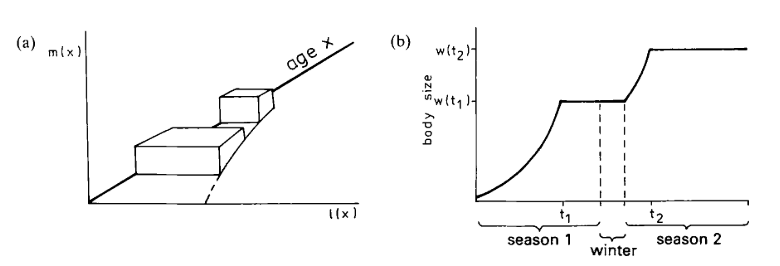

# Global Thesis Notes

## Van's Visit - 9/7/19
### Day 2
Right now, $\alpha$ will keep reducing and $\rho$ will keep increasing in optimisation
* Need a constraint
* Need to make declining suvivorship relative to $\alpha$ thus $t$ becomes $t - \alpha$
* Now survivorship starts at 1 for any $\alpha$ value
* don't optimise on $\alpha$, optimise on $c$ and $\rho$, using the $\alpha Z$ invariant
* $\alpha$ and $\beta$, could use male $m$ to find $b$
* Then simulate fish with reproduction, growth trajectory would be different, and see what optimal $c$ and $\rho$ converge


Tom suggests using:
```
if m + dmdt < 0:
    dmdt = -m
```


## Charnov (2001)
"Under the same growth rate, a larger size requires longer development time, which comes at a cost: delayed reproduction" (p238) </br>
### Optimising
* Proportion of energy to growth - determines body size, determinant of production rate
* Proportion of energy to repro - allocation throughout life defines fitness
* age at maturity $\alpha$
* size at maturity $m_{\alpha}$
* 
$R_{0} \propto \int_{\alpha}^{\infty}L(x)m(x)dx$</br>
Optimising Life history sets $\frac{\partial R_0}{\partial \alpha} = 0$ and $\frac{\partial R_0}{\partial c} = 0$</br>
$cm$ can be optimised wrt $Z$ but no trade-off between the two i.e. high $cm \neq$ high $Z$</br>
it's actually the reverse causality, shorter lifespan (high $Z$) selects for greater per unit time ATR (high $c$)</br>
$c\cdot E$ is average proportion of body mass ATR over average adult lifetime
GSI/$Z$ ratio is invariant $\approx 60\%$ on average </br>
Almost always optimal to give 100% growth to repro at age $\alpha$ i.e. $c = a\cdot m_{\alpha}^{-0.25}-b$ (determinate growth schedule) </br>
Because c/b is a fixed value, assumption leads to lower value for c (than 100) meaning there could be surplus for growth after $\alpha$ (i.e. indeterminate) hence why Charnov believes determinate is unlikely?


### Misc
* Production rate is mediated by mortality + size dependence 
* Implied that size shapes allometries througjh design constraints 
* It was realised that interspecific allometries can be phylogeny-dependent
* cost of being big - delayed reproduction (under same growth rate) and increased risk of dying having not reproduced
* Conversely, larger organisms usually benefit from better reproductive capacity (more energy channeled)
* Growth considered an investment in future reproductive success
* Strictly dominating strategy - extra calorie dedicated to growth yields >1 calorie of reproductive allocation
* Expected future reproduction weighted by probability of surviving to a given age, which is set by mortality rate
* Heavy mortality = investment in future repro is lost
* Production rate also comes into play since growing faster means you can be large quicker
* Energy may be limited by **resource supply** or $t_h$
* Optimal proportions of surplus energy going to different sinks can chance throughout life
* Reproductive allocation throughout life defines fitness
* Growth changes size which is determinant of production rate

## Kozlowski (1987)
Assume a 2-year lifespan </br>
Fitness measured as lifetime energy allocation to reproduction (or no. offspring produced) for species living at most 2 years and reproducing in both years: </br>
$L(x)$ = $\mathbb{P}$(surviving to age $x$) </br>
$m(x)$ = rate of energy allocation to reproduction (or rate of offspring production)</br>
Measure of fitness is equivalent to the volume of two solids, $V_{1} + V_{2}$

$V_{1}$ = reproductive success in first season</br>
$R_{0} \propto \int_{\alpha}^{\infty}L(x)m(x)dx$</br>
$V$ takes maximum for times $t_1, t_2$ </br>
$\frac{dV_1}{dt_1} + \frac{\partial V_2}{\partial t_1} = 0$ and simultaneously $\frac{\partial V_2}{\partial t_2} = 0$

1) $m(x) = 0$ when immature
2) onset of reproduction at age $t$, size $w$, to the end of the first reproduction with reproductive rate $H(w_1)$ (assume size-dependency of reproduction not age)
3) then again $m(x) = 0$ throughout winter and part of growing season 2 prior to switch back to reproduction at age $t_2$, size $w_2$
4) $t_2$ to end of 2nd season, $H(w_2)$

$V(t_1,t_2) = v_1(t_1) + v_2(t_1, t_2)$ </br>
Volume of first solid depends only on $t_1$, age at maturity </br>
second solid depends on age at maturity, $t_1$ and time of switch from growth to reproduction in second year, $t_2 \therefore$ body size in year 2 depends on sum of growth periods in both years

### Kozlowski Notes
* Does Kozlowksi assume that growth and repro cannot occur simultaneously?
* Charnov: he suggests that because Z is different for different species, times for switch from growth to repro should also change. Heavy mortality makes lower $\alpha$ more optimal
* Charnov's crucial assumption is that animals share the same productivity
  * differences scatter the point around allometry lines but don't change the slope
  * Kozlowski & Wiener show otherwise - changing parameters of productivity changes allometry slope
  * $\because$ optimal size depends not only on Z but on $p(m)$ - function describing dependence of productivity rate on body size
* Tus, species with higher production have larger optimal size even if no difference in productivity
* Charnov is heuristically optimistic: everything depends on distribution of $Z$ alone $\therefore$ interspecific allometries he describes have some explanatory meaning
* $P(w) = aw^b$ where $a,b$ are species-specific. Function describes a size-dependent production rate
* Optimal to stop growing + start allocating to reproduction when $\frac{dP(w)}{dw} = m$, $m$ = constant mortality rate
* Optimal size, $w = \Big(\frac{m}{ab}\Big)^{\frac{1}{b-1}}$
* Optimal age at maturity, $\alpha = \frac{1}{a(1-b)}(w^{1-b} - w_{0}^{1-b})$

$\frac{dP(w)}{dw} = baw^{b-1}$ </br>
$baw^{b-1} = m$</br>
$w^{b-1} = \frac{m}{ab}$ </br>
$w = \sqrt[b-1]{\frac{m}{ab}}$ </br>

### Misc Notes
* How do we find how many eggs produced in a lifetime?
* We know age (x), and energy allocation as function of age $m(x)$
* If stop growing at $\alpha$, then would assume that you're just allocating to repro?
* But this assumes that you are always surviving (no $Z$) so $\alpha$ always low
* But $Z$ exists, which introduces $\mathbb{P}$(survival to age $x$) as a third dimension
* Allocation is now height of volume (see Kozlowski figure) - fraction ATR after $\alpha$ is constant
* Given the likelihood you'll survive to age $x$ and that at that age you'll have ATR of $\eta$, the volume is how much you'll reproduce - now what $\alpha$ maximises this volume?
* If $\mathbb{P}$(survival) was 100% then you would omit the $L(x)$ axis
* If energetic cost of producing offspring is constant, then $m(x)$ expressed as rate of production or rate of ATR
* Fecundity gain hypothesis - larger size at maturity (delaying repro) = more offspring - so constant fraction once you have reached terminal size
* $V = H \cdot D \cot W = \alpha \cdot L(x) \cdot age$
* $\frac{dV}{d\alpha} = \frac{dH}{d\alpha}S + H\frac{dS}{d\alpha}$ (product rule $u'v + v'u$)

<figure class="half" style="display:flex">
    
    #
</figure>

## Samraat Dimensionality Paper
Stages:
* Detection
* Capture
* Subjugation

$v_R, v_C \propto m_{C}^{P_{V}}$ </br>
$P_V$ = scaling exponent for consumer or resource  velocity </br>
$d \propto (m_{R}m_{c})^{P_d}$ </br>
$P_d$ = scaling exponent for consumer-resource reaction distance </br>
$t_h \propto m_{C}^{-\beta}$ - exponent for handling time</br>
$K_{RC} = \frac{m_R}{m_C}$ = Body mass ratio</br>

$\alpha = s_{D}v_{R}d^{D-1}$ 
* $\alpha$ = search rate
* $s_{D}$ is 2 in 2D and $\pi$ in 3D
* $v_{R}$ = relative velocity - rate at which c-r pairs converge $v_{R} = \sqrt{v_{R}^2 + v_{C}^2}$
* $d$ = radius of search space

Power for movement is product of body velocity $v$ and force $f$ applied by locomotory appendages onto medium. Assume MR devoted to locomotion is constant proportion of B: </br>
$v \propto \frac{B_{0}m^{\beta}}{F}$ </br>
Force proportional to cross-sectional area of muscle - scales with mass </br>
$v = v_{0}m^{\beta - \beta_{F}}$</br>
$v_{0}$ is a constant which depends on locomotory mode and metabolic scaling exponent </br>
$f(x_{R}) = \frac{\alpha(m_{R}x_{R})^{q+1}}{1 + t_{h}\alpha(m_{R}x_{R})^{q+1}}$

* Pursue, subdue, ingest 1 resource unit
* Delay between encounter + completion of ingestion prevents consumers exploiting resource in direct proprotion to availability
* Type II functional response

as $x_{R} \rightarrow 0$ consumption $\rightarrow \alpha m_{R}x_{R}$ because the 1 in denominator dominates, since second term is multiplied by 0 </br>
as $x_{R} \rightarrow \infty$, consumption $\rightarrow \frac{1}{t_{h}}$ because 1 becomes negligible so can remove, then the $\alpha m_{R}x_{R}$ terms cancel out, leaving $\frac{1}{t_h}$ </br>
where $\frac{1}{t_h}$ = per-capita handling time/resource mass

## Numpy meshgrid
* Creates a matrix of repeated $x$ values in $y$ plane and repeated $y$ values in $x$ plane
* 