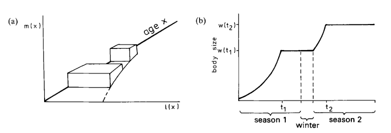
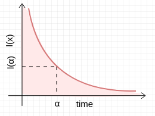
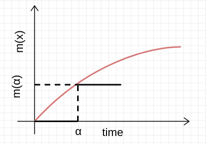
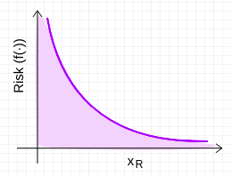
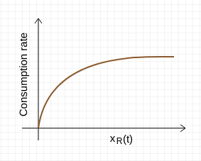

# Global Thesis Notes

## Meeting 11/6/19
## Optimisation
* Target dataset could be $m_alpha$
* Or could be rho optimisation
* 1 = integral, steady state - life histories evened out
    * solve for r - growth fitness
* Implicitly needs redefining what LH need to be optimised
* lxmx = mortality*fecundity - resource supply not
* add in bucket shaped Z - use exponential decay with time
* Assume that very young and old ages have another mortality rate - so different trade-off scaling.
* Can do a sensitivity analysis
* Can use delta as a step function - i.e. hybrid function
* Once solved - can we potentially get data on age at maturation?
* It's easier to optimise exponent on cm term - keep energy intake fixed
    * optimise repro output
* scaling of Lt at any given age?
* At any given mass can numerically integrate reproductive output - cumulative integral from alpha to infinity
* Size-dependent fecundity equation
* scaling beyond age won't hold
* scaling equation fecundity - as function of mass - write-out optimisation parts

## Method
* We can use a piece-wise approach
* Development rate equation
* a priori alpha size - integrating twice
* Juveniles/adults have different foraging strategies
* This offers rationale (?) for two-piece (but West argues alpha is relatively so low that you can just use the second equation)
* alpha at different times (intake rate as alpha at this point)
* juvenile scaling != adult scaling
* optimise scaling given supply?
* go as far as we can analytically

## Meeting 23/7/19
* table for parameter values
* could use diego's data - could actually show hypo - lxmx curve. scaling of peak * fecundity?
* decline in fecundity after that is - scaling of fecundity relate to LH curve - which * part of their LH are we looking at here? Model output
* peak fecundity curve is a function
* emerges as consequence of survivorship 

* master equation
* optimisation equation
* relate two together
* solved it by simultqneously doing numerical integration, and plugging back in

* check carefully for mistake by including mx in such a way - mx should be a curve which * peaks then declines
* fecundity curves with lx curve 
* dont worry about van's sol on the board
* how is optimisation going to be done
* survivorship curve dominates - 
* bounds on parameters in table
* conceptualise what we do/dont have data for - we know this doesnt do anything

* prioritise writing mathematical forumlation and dimensions
* master -> parameters -> dimensions
* scaling equations - no params needed


## Van's Visit - 8/7/19
### Day 1
1. Can keep $b = q\cdot c$
2. Hou *et al.* model - $E_c$ assumed constant
* assume $B_{0}m^{3/4}$ scaling
* portion of metabolism going to our process - $B_{rest}$
* $A(m) = B_{tot} + E_c\frac{dm}{dt} = fB_r + E_c\frac{B_r}{E_m}\Big(1 - \Big(\frac{m}{M}\Big)^{1-\alpha}\Big)$ where $f$ is your "metabolic scope" i.e. active metabolism as a proportion of resting, $f = 1$ when you are resting
* $\therefore \frac{dm}{dt} = \frac{B_r}{E_m}\Big(1 - \Big(\frac{m}{M}\Big)^{1-\alpha}\Big)$
* $am^{?}$ during growth
* $\frac{dm}{dt}$ is combination of storage and biosynthesis term
* $\frac{dm}{dt} = \frac{A(m) - B_{tot}}{E_c}$ where $\frac{A(m)}{E_c} = B_{0}m^{3/4}$
* across species 1 < $f$ < 10 - through growth within species does slope change?
* If active + restime have different mass scalings then as you grow, $f$ **must** change
* **No* evidence for steeper scaling within organism
* Across species confound evolutionary effects (species + strategies)
* Hou *et al.* have $f + \gamma$
* $f$ partially scales with mass
* Hou *et al.*: "equation 3 is general, indication of ow $B_{rest}, B_{maint}$ and $f$ scale with mass
* $B_{tot} = B_{maint} + B_{growth} + B_{rep}$
* $A(m) = B_{maint} + B_{act}(m) + B_{syn}(m) + S(m)$
* $A(m) = (f+\gamma)B_{rest}(m) - \gamma B_{maint}(m)$
* $\gamma$ is amount going to storage (storage coefficient)
  * $fB_r + \gamma B_r\Big(1-\frac{m}{M}\Big)^{1-\alpha}$
  * $(f+\gamma)B_r - \gamma B_r\Big(1-\frac{m}{M}\Big)^{1-\alpha}$
* $(1-\alpha)$ generates quarter power scaling
* If we assume $B_{rest} = B_{0}m^{\alpha}$:
  * $A(m) = (f+\gamma)B_{0}m^{\alpha} - \gamma B_{0}m^{\alpha}\Big(1-\frac{m}{M}\Big)^{1-\alpha}$
  * $A(m) = (f+\gamma)B_{0}m^{\alpha} - \gamma B_{0}\frac{m^1}{M^{1-\alpha}}$
  * $fB_r + \frac{E_c}{E_m} B_r\Big(1-\frac{m}{M}\Big)^{1-\alpha}$
  * when $m = 1$, term $= 0$, as $m \rightarrow 0$, term $= 1$
* Diego and Andrew:
  * Let $\gamma = \frac{E_c}{E_m}$
    * $E_m$ = energy required to synthesise unit of biomass (energetic cost)
    * $E_c$ = structural cost
    * ATP vs actual use of molecules
* Tom: "framework doesn't simplift ATR problem"
* Samraat: "energy expended during growth is partitioned between energy content stored in newly synthesised biomass + energy expended in synthesising this biomass"
* Question is what are we trying to do here? Diego did this from perspective of understanding how much energy availble in fish community after growth
* $A(m)$ has relationship with all pieces - $f, \gamma, B_0$ - end up with $A(m)$ curve normalised
* Point of Hou *et al.* is that there exists a universal optima; assimilation rate (see figure) - we are not necessarily going for assimilation - we actually want to understand what would happen to $dm/dt$ if we change $A(m)$ itself
* We wouldn't replace $dm/dt$ - wouldn't express in terms of asymptotic mass - we want to establish asymptotic mass by $\int\frac{dm}{dt}$
* We wouldn't set $B_r = B_{0}m^{3/4}$ (about creating mass)
* Van: In this model (Hou *et al.*) if you're fimishing growing and you reproduce, it would be outside scope of model $b/c \ \ \ m = M$
* Only makes indeterminate fish, in which case think of growth term being either growth or growth of eggs, but once stored them, not part of equation anymore
* Point of paper is discussing assimilation itself - not previously done - assumed to be $3/4$
* Tom: "in terms of ATR there would be a way to include it at a cellular level and build up from that"
* Simplest function for growth to no growth
* Effective storage changing throughout lifetime since $\frac{m}{M}$ is proportion (Hou *et al.*)

### Two-piece model
* $dm/dt = am^{3/4} - bm - cm^{\rho} \ \ \ \ m > m_{\alpha}$
* $\rho = 1$ in Charnov model
* Maximise $\int_{\alpha}^{\infty}L_{t}b_{t}dt$ where $b_t$ is fecundity output at time $t$ NOT a rate.
* Fecundity at time $t$ is subject to fecundity curve AND survivorship curve
* Diego's new frequency data is still within interval (e.g. a few bouts) - not lifetime growth
* Difficult to measure over time
* Diego accounts for egg size by taking energy content
* Luke: also if you are measuring across sizes which correlates with age, surely you are measuring across this fecundity curve
* Samraat: we won't worry about $cm^{\rho}$ as parameter but optimise $\rho$ given an intake rate
* Breeding is phenologically synced with food availability
* 20kg cod still reproducing so is $\alpha < 20kg$ or has $\alpha$ shifted?
* Multiple things to optimise, even $c$ (GSI)
* We stick with $3/4$ for assimilation - you could optimise it, but for basal MR data we quite reliably get $3/4$ power scaling - assuming intake is fine
* Only limited by fractal architecture of capillaries
* Van: $am^{3/4}$ **is** assimilation but not just for basal.
* Maximal rate scales more steeply - you could be assimilating to be at maximal. Fractal limits basal (since it is an assumption of the West *et al.* model) not necessarily active.


### Day 2
Right now, $\alpha$ will keep reducing and $\rho$ will keep increasing in optimisation
* Need a constraint
* Need to make declining suvivorship relative to $\alpha$ thus $t$ becomes $t - \alpha$
* Now survivorship starts at 1 for any $\alpha$ value
* don't optimise on $\alpha$, optimise on $c$ and $\rho$, using the $\alpha Z$ invariant
* $\alpha$ and $\beta$, could use male $m$ to find $b$
* Then simulate fish with reproduction, growth trajectory would be different, and see what optimal $c$ and $\rho$ converge


Tom suggests using:
```
if m + dmdt < 0:
    dmdt = -m
```
## Miscellaneous
Approach:
1. Gap in the literature - rationale
2. Our model - using intake
3. Results - figures (Hou *et al* figure)
4. $cm^{\rho}$
* Why superlinear fecundity emerges
* Resource supply AND questionable
* Sufficient resources not to shrink
* New way to quantify intake rate
* Life history traits at different timescales: $\alpha, \rho$
* Could we fix $\alpha$ and optimise $c$ and $\rho$?
* Figure $I$ vs $c, \rho$
* 
## Diego's Visit - 
$A(m) = B_{tot} + E_{c}\frac{dm}{dt}$ </br>
$B_{tot} = B_{maint} + B_{growth}$ where $B_{maint}$ is in W (J/S) and is part of $B_{tot}$</br>
$B_{0}m^{3/4} = bm + E_{c}\frac{dm}{dt}$ where $b_m$ is in $\frac{J}{s\cdot kg}$ b is $N_{c}B_{maint,c} = \frac{m}{m_c}B_{maint,c}$</br>
$dm/dt = am^{3/4} - bm$ where $a = \frac{B_0}{m_c}$ and if you take $b/E_c$ units are $1/skg$ </br>
Does your scope increase as you get bigger? within species
$A(m) = fB_r + E_{c}\frac{B_r}{E_m}\Big(1-\Big(\frac{m}{M}\Big)^{1-\alpha}\Big)$ where $f = \alpha m$?</br>
Diego's rate data is within a few bouts </br>
**NB:** Trade-off between $\psi$ and $I_0$ </br>
$t_f \rightarrow 0$ get back to basal </br>
if timescales align then $\psi + \gamma - \frac{1}{4} = \frac{3}{4} + \frac{1}{4} - \frac{1}{4} = \frac{3}{4}$ which is back to basal MR </br>
Reproduction intervals/frequency </br>
do $\Delta t_R$ scale same as $\Delta t_f$? Do the two time scales come closer as $m\downarrow$, stretching long $am$ timescale across $cm^{\rho}$ timescale - right way round </br>
Mortality rate could change so that $\alpha$ changes</br>
endothermy evolved because of times of no supply</br>
Determinate growth is result of high maintenance? What is the mechanism here?</br>
Synchrony between reproductive timescale versus intake i.e. phytoplankton glut</br>
We need data supporting foraging timescales of $t = t_{0}m^{3/4}$ and parameter values for every piece</br>
* Models assume 100% $\varepsilon$ and all Carbon is assimulated
* meaning egestion is purely N and P
* Carbon-loss not important at individual level
* Eating extra carbon to reach nitrogen target
* $I_{tot}\varepsilon = B_{0}m^{\alpha}\Big[f+\frac{E_c}{E_m}\Big(1-\Big(\frac{m}{M}\Big)^{1-\alpha}\Big)\Big]$
* $I_{tot}\varepsilon = B_{0}m^{\alpha}f + E_{c}\frac{dm}{dt}$
* $\frac{dm}{dt} = \frac{I_{tot}\varepsilon - B_{0}m^{\alpha}f}{E_{c}}$
* $\frac{dm}{dt} = \frac{a_{0}m^{\gamma + \psi} - B_{0}m^{\alpha}f}{E_{c}}$
* Expand notebook to include both derivations
  * come up with end result $dm/dt$
* $B_{tot} = fB_{rest}$ then follows Hou *et al.* approach.
* $fB_{rest}$ then becomes $cm$ term for reproduction
* For publication needs to be validated with data
* Outputs signature of intake rate on fecundity scaling
* Trade-off across species in egg size
* No trade-off within species for all 3 (Diego paper)
* Essentially we want a cohort + repeated measures - foraging timescale and growth timescale
* Maybe hyperallometry drops after fecundity peak
* Mortality: $e^{-\mu t}$ and $\mu (m)$ weak scaling with mass

## Our Intake Rate Model

* $\text{Intake rate} = I_{0}m^{\gamma}$
* $\text{Total intake} = I_{0}m^{\gamma}*t$
* $\text{Total intake} = I_{0}m^{\gamma}t_{0}m^{\psi}$
* $\text{Total intake, } I_{tot} = I_{0}t_{0}m^{\gamma + \psi}$

* Which in effect is "mass-specific intrinsic distribution of resources"
* $\frac{dm}{dt} = I_{tot}\epsilon\Big(am^{-\frac{1}{4}}\Big) - bm - cm^{\rho}$
* $\frac{dm}{dt} = I_{0}t_{0}m^{\gamma + \psi}\epsilon\Big(am^{-\frac{1}{4}}\Big) - bm - cm^{\rho}$
* $\frac{dm}{dt} = I_{0}t_{0}\epsilon am^{\gamma + \psi}\Big(m^{-\frac{1}{4}}\Big) - bm - cm^{\rho}$
* $\text{let } a_0 = I_{0}t_{0}\epsilon a$
* $\frac{dm}{dt} = a_{0}m^{\gamma + \psi -\frac{1}{4}} - bm - cm^{\rho}$
* 2D Saturated --> Intake = $a\varepsilon I_{0}t_{0}m^{\frac{3}{4}+\beta-{\frac{1}{4}}}$
* 3D depleted --> Intake = $a\varepsilon I_{0}t_{0}m^{1.06+\beta-{\frac{1}{4}}}$
* If the foraging time scales as $3/4$ then $3/4 + 3/4 - 1/4 = 5/4 = 1.25$
* Cod - total length max 80cm $\therefore$ weight $= 0.00624(80)^{3.126} = 5549.372$
* $a$ and $b$ are calculated from fundamental cellular properties
* Energy content of mammalian tissue $\approx 7e6Jkg^{-1}$
* $m_c \approx 3e-9g$
* $\therefore$ energy to create cell $E_c \approx 2.1e-5J$ (in vivo)
* $B_0 \approx 1.9e-2 W$
* $\therefore a \equiv B_{0}m_c/E_c \approx 0.25g^{1/4}day^{-1}$
* $E_{g} = \int E_{c}\frac{dN_c}{dt}dt = \frac{E_c}{m_c}\int\frac{dm}{dt}dt = \frac{E_c}{m_c}(m_M - m_0)$
* West *et al.* say add egg term but this increases maintenace only
* also $t$ estimated to be so small that only 1 equation matters - skip optimisation o $\alpha$ since time period prior to $\alpha$ is negligible
* $B = \sum\limits_c \Big[N_{c}B_{c} + E_{c}\frac{dN_c}{dt} + E_{e}\frac{dN_e}{dt}\Big]$
* During spawn, mass of clutch, $m_K = m_e\Delta N_e$ = constant fraction of mass i.ie $= \lambda m$
* $\therefore E_e\frac{dN_e}{dt} \approx E_e\frac{\Delta N_e}{\Delta t} \approx \frac{\lambda E_{e}m}{m_{e}t_{s}}$
* energy density is similar s.t. $\frac{E_e}{m_e} \approx \frac{E_c}{m_c}$
* $\therefore \frac{E_{e}dN_{e}}{dt} \approx \lambda \big(\frac{E_c}{t_s}\big)N_c$
* so $B_c$ becomes $\Big(B_c + \lambda \frac{E_c}{t_s}\Big) and maintenance goes up i.e. same as Charnov's trade-off but with first principles logic
* Charnov says GSI = c and $GSI/Z$ invariant $\approx 0.6$ - tie this to West *et al.*'s comment on short immaturity period

## Our model's Life History
### Survivorship
* $R_0 = \int_{\alpha}^{\infty} l_{x}b_{x}dx$
* let $l_x = l_{\alpha}e^{-Z(x-\alpha)}$
* and $l_{\alpha} = \int_{0}^{\alpha}e^{-Z_{J}\alpha}dx = e^{-Z_{J}\alpha}$
* $\therefore R_0 = \int_{\alpha}^{\infty}e^{-Z_{J}\alpha}e^{-Z(x-\alpha)}bx dx$
* $R_0 = e^{-Z_{J}\alpha}\int_{\alpha}^{\infty}e^{-Z(x-\alpha)}bx dx$
* $l_{\alpha}$ effectively becomes a scaling term - how many juveniles make it to the $\alpha$ timepoint - height of fecundity*survivorship curve
* We explore $b_x$ using a decay rate parameter $\kappa$
* $b_x = b_{pk}e^{-\kappa(x-\alpha)}$

### Recent notes - Objectives
* Discuss resource supply problem right from outset - context of master equation
* Problem with resource supply
* might explain recent finding...
* Write units in-line
* $Z(x)$ is a constant factor
* Easiest option: assume within survivorship, fecundity is constant (not decaying) - increasing output with no trade-off
* fix $\kappa = 0$ and output optimisation surfaces for $c$ and $\rho$

### Fecundity function
* $R_0 = \int_{\alpha}^{\infty} cm^{\rho}e^{-\kappa(x-\alpha)}\cdot L_t dt$
* $b_x = cm^{\rho}h(t)$ where $h(t)$ is like an efficiency term
* $b_x = cm^{\rho}e^{-\kappa(t-\alpha)}$
* $\alpha\cdot Z$ invariant
* $0 < \kappa < 0.1$
* $dm/dt = am^x - bm - (cm^{\rho})h(t)$ - **BUT** is this correct? Mathematically you are still losing **less** energy as you get older, allowing more for growth
* $R_0 = \int cm^{\rho}h(t) \cdot L_t dt$
* $R_0 = \int cm^{\rho}(t)^{\rho}e^{-\kappa(t-\alpha)}\cdot l_{\alpha}e^{-Z(t-\alpha)}dt$
* $R_0 = c\cdot l_{\alpha}\int m(t)^{\rho}e^{-\kappa(t-\alpha)}\cdot^{-Z(t-\alpha)}dt$
* $R_0 = c\cdot l_{\alpha}\int m(t)^{\rho}e^{-(\kappa + Z)(t-\alpha)}dt$
* $R_0 = c\cdot \int_{0}^{\alpha}e^{-Z(t)}dt\int_{\alpha}^{\infty} m(t)^{\rho}e^{-(\kappa + Z)(t-\alpha)}dt$
* Define two new constants
  * $q_1 = \alpha \cdot Z$
  * $q_2 = \frac{\int_{\alpha}^{\infty}b(t)dt}{L}$ "lifetime fecundity output as a proportion of lifespan"

### Alex's help with rearranging West *et al.* sum
* $B = \sum_{c}\Big[N_{c}B_{c} + E_{c}\frac{dN_{c}}{dt} \Big]$
* $B = \sum_{c} \Big[N_{c}B_{c} \Big] + \sum_{c} \Big[ E_{c}\frac{dN_{c}}{dt} \Big]$
* $B - \sum_{c} \Big[N_{c}B_{c} \Big] = \sum_{c} E_{c} * \sum_{c}\frac{dN_{c}}{dt}$
* $\sum_{c}\frac{dN_{c}}{dt} \geq \frac{B - \sum_{c} \Big[N_{c}B_{c} \Big]}{\sum_{c}E_{c}}$
* $\because a_{1}b_{1} + a_{2}b_{2} \leq (a_{1}a_{2})(b_{1}b_{2})$

### Presentation feedback
* Superlinear scaling possible
* Growth dependent on component
* LH in methods not intro - means to an end
* Intro: people have ignored resource supply
* Not *too* much emphasis
* Diego's result is a two-line mention at most... "which means that if we ignore.... we get shrinking fish" - consequence vs rationale
* Less focus on the specific results of Pawar *et al.* - focus is on energy supply and Pawar *et al.* is a good example
* Results: Max fitness $\rightarrow$ Measure $R_0 \rightarrow$ equations

### Lyon poster notes
* $M = \Big(\frac{a}{b+c}\Big)^4$
* Equation is always finite, $m$ won't go $\rightarrow \infty$ in finite time
* Gonzalez-Forereo PLoS comp. He says do a phase portrait since high $\rho$ value may cause bifurcation
* Fisher (1950) - size of offspring/size of population rule


## Charnov (2001)
* Develops new evolutionary model for life histories by combining new production-growth model with some general constraints on reproductive allocation
* invariance across fish species of dimensionless numbers made up from reproductive & timing variables: age at maturity/average lifespan and proportion of mass to repro X E
* these invariants apply within closely related taxons
* i.e. after removing absolute scale (age) then life histories of elephants and squirrels look much more alike than elephants versus fish
* Disagreement over how well E correlates with $\alpha$ such that claiming $\frac{E}{\alpha}$ is invariant is true, but R$^2$ > 0.8 usually.
* Evolutionary LHT can be used to predict when such dimensionless invariance is expected
* Model allows natural selection to adjust age of first breeding and metabolic production - growth - capacity of cells
* Optimal LHT correctly predicts numeric value of dimensionless numbers which combine maturation age (size), mortality & reproductive allocation
* LH prediction yields new model & predicts fastest growth rate to be near the size of first reproduction
* Charnov says West *et al.* equation excludes reproduction which changes the asymptotic size to $\Big(\frac{a}{b+c}\Big)^4$
* Notes that gonad mass in fish is commonly proportional to body mass, thus after age $\alpha$, growth = $dm/dt = am^{.75} - (b+c)m$
* Thus, lifetime growth reflects production & timing ($\alpha$) & magnitude ($c\cdot m$) of reproduction
* If population size is fixed (i.e. not growing) then can calculate $c\cdot m$
* Evolutionary optimisation argument: $\alpha$ and $c$ chosen to maximise a quantity proportional to lifetime production of offspring in the face of a mortality rate $Z$ which is externally imposed


"Under the same growth rate, a larger size requires longer development time, which comes at a cost: delayed reproduction" (p238) </br>
### Optimising
* Proportion of energy to growth - determines body size, determinant of production rate
* Proportion of energy to repro - allocation throughout life defines fitness
* age at maturity $\alpha$
* size at maturity $m_{\alpha}$

$R_{0} \propto \int_{\alpha}^{\infty}L(x)m(x)dx$</br>
Optimising Life history sets $\frac{\partial R_0}{\partial \alpha} = 0$ and $\frac{\partial R_0}{\partial c} = 0$</br>
$cm$ can be optimised wrt $Z$ but no trade-off between the two i.e. high $cm \neq$ high $Z$</br>
it's actually the reverse causality, shorter lifespan (high $Z$) selects for greater per unit time ATR (high $c$)</br>
$c\cdot E$ is average proportion of body mass ATR over average adult lifetime
GSI/$Z$ ratio is invariant $\approx 60\%$ on average </br>
Almost always optimal to give 100% growth to repro at age $\alpha$ i.e. $c = a\cdot m_{\alpha}^{-0.25}-b$ (determinate growth schedule) </br>
Because c/b is a fixed value, assumption leads to lower value for c (than 100) meaning there could be surplus for growth after $\alpha$ (i.e. indeterminate) hence why Charnov believes determinate is unlikely?


### Misc
* Production rate is mediated by mortality + size dependence 
* Implied that size shapes allometries througjh design constraints 
* It was realised that interspecific allometries can be phylogeny-dependent
* cost of being big - delayed reproduction (under same growth rate) and increased risk of dying having not reproduced
* Conversely, larger organisms usually benefit from better reproductive capacity (more energy channeled)
* Growth considered an investment in future reproductive success
* Strictly dominating strategy - extra calorie dedicated to growth yields >1 calorie of reproductive allocation
* Expected future reproduction weighted by probability of surviving to a given age, which is set by mortality rate
* Heavy mortality = investment in future repro is lost
* Production rate also comes into play since growing faster means you can be large quicker
* Energy may be limited by **resource supply** or $t_h$
* Optimal proportions of surplus energy going to different sinks can chance throughout life
* Reproductive allocation throughout life defines fitness
* Growth changes size which is determinant of production rate

## Charnov (2004)
$R_0 = \int_{\alpha}^{\infty}L_{t}b_{t}dt$ </br>
$R_0 = \int_{\alpha}^{\infty}L_{t}cm_{t}dt$
* $R_t$ = net reproductive rate (mean offspring over lifespan)
* $L_t$ = chance of being alive at age/time $t$
* $f_t$ = offspring produced at age $t$

Fixed offspring (egg) size (I)</br>
$f_t = \frac{cm_t}{I}$ or $f_t \propto cm_t \because$ egg size is fixed so number produced must be proportional to mass allocated</br>
$b$ = maintenance MR per cell/Cost of building new cell </br>
$\frac{c}{b} = q$ high $c$ requires high $b$ - multiplier</br>
$c = bq$ and $\frac{c}{Z}$ quantity</br>
Optimising Life history sets $\frac{\partial R_0}{\partial \alpha} = 0$ and $\frac{\partial R_0}{\partial c} = 0$</br>
Instantanteous mortality rate $Z$ high at low $t$ (i.e. high when young) but drops to a constant $Z$ as $t \rightarrow \alpha$

## Kozlowski (1987)
Assume a 2-year lifespan </br>
Fitness measured as lifetime energy allocation to reproduction (or no. offspring produced) for species living at most 2 years and reproducing in both years: </br>
$L(x)$ = $\mathbb{P}$(surviving to age $x$) </br>
$m(x)$ = rate of energy allocation to reproduction (or rate of offspring production)</br>
Measure of fitness is equivalent to the volume of two solids, $V_{1} + V_{2}$

$V_{1}$ = reproductive success in first season</br>
$R_{0} \propto \int_{\alpha}^{\infty}L(x)m(x)dx$</br>
$V$ takes maximum for times $t_1, t_2$ </br>
$\frac{dV_1}{dt_1} + \frac{\partial V_2}{\partial t_1} = 0$ and simultaneously $\frac{\partial V_2}{\partial t_2} = 0$

1) $m(x) = 0$ when immature
2) onset of reproduction at age $t$, size $w$, to the end of the first reproduction with reproductive rate $H(w_1)$ (assume size-dependency of reproduction not age)
3) then again $m(x) = 0$ throughout winter and part of growing season 2 prior to switch back to reproduction at age $t_2$, size $w_2$
4) $t_2$ to end of 2nd season, $H(w_2)$

$V(t_1,t_2) = v_1(t_1) + v_2(t_1, t_2)$ </br>
Volume of first solid depends only on $t_1$, age at maturity </br>
second solid depends on age at maturity, $t_1$ and time of switch from growth to reproduction in second year, $t_2 \therefore$ body size in year 2 depends on sum of growth periods in both years

### Kozlowski Notes
* Does Kozlowksi assume that growth and repro cannot occur simultaneously?
* Charnov: he suggests that because Z is different for different species, times for switch from growth to repro should also change. Heavy mortality makes lower $\alpha$ more optimal
* Charnov's crucial assumption is that animals share the same productivity
  * differences scatter the point around allometry lines but don't change the slope
  * Kozlowski & Wiener show otherwise - changing parameters of productivity changes allometry slope
  * $\because$ optimal size depends not only on Z but on $p(m)$ - function describing dependence of productivity rate on body size
* Tus, species with higher production have larger optimal size even if no difference in productivity
* Charnov is heuristically optimistic: everything depends on distribution of $Z$ alone $\therefore$ interspecific allometries he describes have some explanatory meaning
* $P(w) = aw^b$ where $a,b$ are species-specific. Function describes a size-dependent production rate
* Optimal to stop growing + start allocating to reproduction when $\frac{dP(w)}{dw} = m$, $m$ = constant mortality rate
* Optimal size, $w = \Big(\frac{m}{ab}\Big)^{\frac{1}{b-1}}$
* Optimal age at maturity, $\alpha = \frac{1}{a(1-b)}(w^{1-b} - w_{0}^{1-b})$

$\frac{dP(w)}{dw} = baw^{b-1}$ </br>
$baw^{b-1} = m$</br>
$w^{b-1} = \frac{m}{ab}$ </br>
$w = \sqrt[b-1]{\frac{m}{ab}}$ </br>

### Misc Notes
* How do we find how many eggs produced in a lifetime?
* We know age (x), and energy allocation as function of age $m(x)$
* If stop growing at $\alpha$, then would assume that you're just allocating to repro?
* But this assumes that you are always surviving (no $Z$) so $\alpha$ always low
* But $Z$ exists, which introduces $\mathbb{P}$(survival to age $x$) as a third dimension
* Allocation is now height of volume (see Kozlowski figure) - fraction ATR after $\alpha$ is constant
* Given the likelihood you'll survive to age $x$ and that at that age you'll have ATR of $\eta$, the volume is how much you'll reproduce - now what $\alpha$ maximises this volume?
* If $\mathbb{P}$(survival) was 100% then you would omit the $L(x)$ axis
* If energetic cost of producing offspring is constant, then $m(x)$ expressed as rate of production or rate of ATR
* Fecundity gain hypothesis - larger size at maturity (delaying repro) = more offspring - so constant fraction once you have reached terminal size
* $V = H \cdot D \cot W = \alpha \cdot L(x) \cdot age$
* $\frac{dV}{d\alpha} = \frac{dH}{d\alpha}S + H\frac{dS}{d\alpha}$ (product rule $u'v + v'u$)




#


## Samraat Dimensionality Paper
Stages:
* Detection
* Capture
* Subjugation

Paper models the biomechanics of searching and attacking

$v_R, v_C \propto m_{C}^{P_{V}}$ </br>
$P_V$ = scaling exponent for consumer or resource  velocity </br>
$d \propto (m_{R}m_{c})^{P_d}$ </br>
$P_d$ = scaling exponent for consumer-resource reaction distance </br>
$t_h \propto m_{C}^{-\beta}$ - exponent for handling time</br>
$K_{RC} = \frac{m_R}{m_C}$ = Body mass ratio</br>

$\alpha = s_{D}v_{R}d^{D-1}$ 
* $\alpha$ = search rate
* $s_{D}$ is 2 in 2D and $\pi$ in 3D
* $v_{R}$ = relative velocity - rate at which c-r pairs converge $v_{R} = \sqrt{v_{R}^2 + v_{C}^2}$
* $d$ = radius of search space

Power for movement is product of body velocity $v$ and force $f$ applied by locomotory appendages onto medium. Assume MR devoted to locomotion is constant proportion of B: </br>
$v \propto \frac{B_{0}m^{\beta}}{F}$ </br>
Force proportional to cross-sectional area of muscle - scales with mass </br>
$v = v_{0}m^{\beta - \beta_{F}}$</br>
$v_{0}$ is a constant which depends on locomotory mode and metabolic scaling exponent </br>
$f(x_{R}) = \frac{\alpha(m_{R}x_{R})^{q+1}}{1 + t_{h}\alpha(m_{R}x_{R})^{q+1}}$

* Pursue, subdue, ingest 1 resource unit
* Delay between encounter + completion of ingestion prevents consumers exploiting resource in direct proprotion to availability
* Type II functional response

as $x_{R} \rightarrow 0$ consumption $\rightarrow \alpha m_{R}x_{R}$ because the 1 in denominator dominates, since second term is multiplied by 0 </br>
as $x_{R} \rightarrow \infty$, consumption $\rightarrow \frac{1}{t_{h}}$ because 1 becomes negligible so can remove, then the $\alpha m_{R}x_{R}$ terms cancel out, leaving $\frac{1}{t_h}$ </br>
where $\frac{1}{t_h}$ = per-capita handling time/resource mass

## Dimensionality and Growth
* $B$ assumes constant rate of energy flow
* If define $B$ as $f$(energy supply in env) (type II functional response)
* Suspicion that West **et al.** cherry picked their growth data from lab with idealised conditions
* If energy flow is consumption then $B = C = am_{R}x_{R}f(\cdot)$
* $a$ = search
* $m_R$ = mass of resource 
* $x_R$ = abundance of resource - Damuth's law
* $f(\cdot) = \frac{1}{1+at_{h}x_{R}}$ note there is no mass term here - only in terms of individuals - second term units: $\text{Individual} \cdot \frac{\text{Area}}{\text{Time}} \cdot Time \cdot \frac{\text{Individual}}{\text{Area}}$ so dimensionless
* But consumption also a function of time which can vary - because organisms move between resource depleted and saturated environments and 2D and 3D
* Thus is type 2 but abundance of resource can actually fluctute through time (abundance of resource is a function of time) 


.



## Numpy meshgrid
* Creates a matrix of repeated $x$ values in $y$ plane and repeated $y$ values in $x$ plane

## Thesis notes: meeting with Dr Samraat Pawar - 2/4/2019 14:00 - 15:00
## Modelling Fish Growth
* Thus far, energy supply is treated as an implicit assumption in growth/fecundity models. Incorporate as an explicit assumption.
* What do we need to change in the West \& Brown model?
* Check forward citations of Chernov paper to see other models people have come up with.
* Problem of resource supply:
    * governing equations
    * master equation energy balance
* Useful to specify master equation in more meaningful way.
* Diego's results suggest lifehistory must be getting enough resource supply


## Thesis notes: meeting with Dr Samraat Pawar

## Option 1: Carbon Flux
* Stability or volume of carbon eflux from ecosystem
* Relation to species interactions/does it matter?
* More focus on microbial networks
* Talk to Tom Clegg, it involves modelling dynamical systems - interactions effecting dynamics - ODEs
* individual $\rightarrow$ multiple pops competing with each other for same resource


## Option 2: Modelling Fish Growth
* Find the growth model which is worth pursuing
*  Reproduction in fish $\rightarrow$ understanding growth in fish.
* Use symbolic regression to identify what combo works best/explains best
* Population growth - mass conservation equation
* Brown equist model - universal model which predicts ecto/endotherm growth rates.
* Diego's post-doc advisor - carbon economy of the individual
* Optimisation - write equation for carbon economy to maximise fitness (growth strategy or size)
* Equation which maximises reproductive output of an individual, energy-balance - maximise remaining energy in organism, left over for reproduction
*  Richer dataset - more ready things, provide empirical data.

